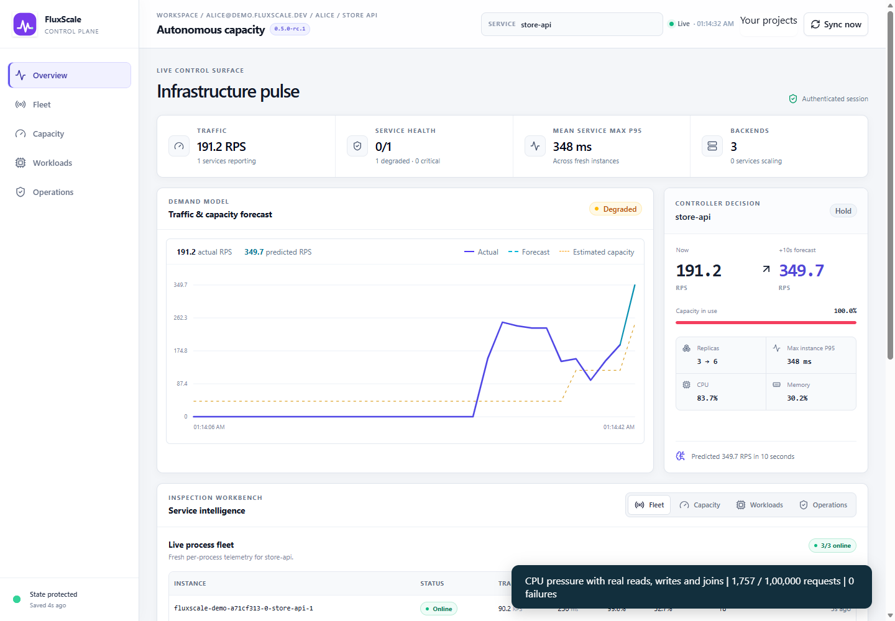

# FluxScale

FluxScale is a self-hosted predictive autoscaling controller with a Rust HTTP
proxy, a Node/Express telemetry SDK and a light React console. It learns from
observed traffic and pressure, explains replica targets, and safely drains
managed Docker replicas as demand falls.

Current release candidate: **0.5.0-rc.1**. The supported local path is **Windows,
Node 24, Rust MSVC and Docker Desktop with Linux containers**, running one
controller and the supplied managed Express application on one Docker host.
The API checkpoint label remains `8A`; clients should use `/health.capabilities`.

To integrate your own application, start with [the deployment and SDK guide](docs/INTEGRATION.md).
For individual accounts, project isolation and live remote-host reports, use the
[connected dashboard setup](docs/CONNECTED_DEPLOYMENT.md). Each project connects
to its own local controller; Docker execution stays on the application's host.
The [recorded demo and measured analysis](docs/DEMO.md) exercise real scale-out and
scale-in with 100,000 application requests and separate users' project dashboards.
The supplied Compose profile packages the controller and console together, keeps
the administrative API on host loopback, and reaches replicas over private Docker
DNS. Configure your application image, health route, quotas and replica bounds.
An installable SDK tarball and clean source archive are produced by the release command.



Original React console captured during the measured local demo: actual
Docker replicas, live SDK telemetry and a user-scoped workspace. The workload mixes
real CPU computation, PostgreSQL reads, writes and five-table joins. Offered
rate targets and achieved throughput are reported separately.

## Build and start

Open PowerShell in this project. If your Rust linker requires Visual Studio,
use Developer PowerShell. Docker Desktop must be running.

```powershell
.\scripts\build.ps1
.\scripts\start.ps1
```

The build restores locked npm dependencies, checks Rust and JavaScript tests,
builds the console/controller and stages a reparse-safe Express Docker image.
The first start creates three distinct credentials encrypted for your current
Windows account in `.fluxscale/tokens.clixml`. It preserves existing runtime
history in `data/fluxscale-state.json`. Neither directory belongs in source control.

In a second PowerShell terminal, from this project:

```powershell
.\scripts\start_demo.ps1
.\scripts\local_tokens.ps1
Set-Clipboard $env:FLUXSCALE_READ_TOKEN
```

Open [the local console](http://127.0.0.1:8080), paste the read token, then clear
your clipboard. The demo command provisions the minimum replica; containers
subsequently send their own authenticated telemetry. Once its backend is healthy:

```powershell
Invoke-RestMethod http://127.0.0.1:8081/sdk-demo-api/api/fast
node .\scripts\load_managed.mjs http://127.0.0.1:8081/sdk-demo-api 40 1500
```

The load deliberately adds 1500 ms of application delay to exercise latency-driven
scale-out and recovery. It is not a maximum-capacity benchmark. The local profile
bounds replicas to 1-3 and each container to one CPU and 256 MiB.

`fluxscale.local.toml` enables security and same-origin console serving. The older
`fluxscale.toml` remains a legacy development configuration with security disabled.
The local profile binds the API to all interfaces so Docker Desktop containers can
reach `host.docker.internal`; keep it inside a trusted host/network with an
appropriate firewall. TLS/Internet exposure is outside this local setup.

## Verify

```powershell
.\scripts\verify.ps1
```

Stop the local controller with Ctrl+C before full verification: Windows locks its
executable while running. Managed containers remain available for restart adoption.

This runs locked builds, SDK container-quota checks, auth/audit/non-mutation checks, Prometheus parsing, two
real managed proxy-load cycles separated by a persisted restart, active-request
draining, offline checkpoint recovery and a real headless Edge dashboard test. Tests use isolated state,
credentials, service names and ports and clean up their own processes/containers.
The browser test requires installed Microsoft Edge and Node 24. Verification
artifacts from workload tests are retained under the Windows temporary directory.

For quicker builds without Docker, use `build.ps1 -SkipDocker`. Verifiers run
sequentially because Windows locks an executing controller binary.

To check recovery while your demo keeps running, use `node scripts/verify_recovery.mjs`.
It copies the built executable, uses temporary state and random loopback ports,
and retains logs and checkpoint evidence. The artifact switch is a same-version
rollback rehearsal; it does not establish compatibility with an older release.

For the complete source/SDK/Windows artifact and container deployment checks, run
`.\scripts\release.ps1`. The outputs and SHA-256 checksums are placed in `artifacts/`.
See [release scope](docs/RELEASE.md) and the [announcement draft](docs/LINKEDIN.md).

## Endpoints

| Endpoint | Purpose / access |
| --- | --- |
| `GET /` | Built console, when `server.dashboard_path` is configured |
| `GET /health` | Liveness, version and capabilities; public in the local profile |
| `GET /api/v1/observability/ready` | Public readiness; 200 ready, 503 degraded |
| `GET /api/v1/observability/metrics` | Prometheus exposition; read token |
| `POST /api/v1/metrics` | SDK telemetry; ingest or managed token according to execution mode |
| `GET /api/v1/services` | Service snapshots; read token |
| `GET /api/v1/services/{service}/instances` | Instance telemetry and freshness; read token |
| `GET /api/v1/persistence` | Checkpoint and restore status; read token |
| `GET /api/v1/audit` | Bounded operational events; read token |
| Proxy `/{service}/{path}` on port 8081 | Managed application routing |

Only the managed role authorizes Docker changes. Read and ingest roles are
separate; the dashboard only needs a read token. Observe-only ingestion never
schedules Docker work.

## Scope and operations

See [the operations guide](docs/OPERATIONS.md) for rotation, restart, backup,
restore, upgrades, cleanup and monitoring, and [the verification report](docs/VERIFICATION.md)
for measured results and remaining release limits.

The proxy buffers both directions, bounds each body to `proxy.max_body_bytes`
(default 1 MiB), and times out upstream requests after 30 seconds. Streaming,
WebSockets and transparent redirect rebasing are unsupported. In the supported
Docker cgroup-v2 setup, SDK process CPU and RSS percentages use the container's
CPU quota and OS memory constraint. They exclude other processes and memory cache.
Fleet latency is the maximum of instance P95s, not a merged
fleet quantile. A shared host has finite capacity; replicas do not create more
hardware. Keep service/instance identities stable: this version is a trusted
single-controller setup, without tenant isolation, HA or a cloud provisioner.
