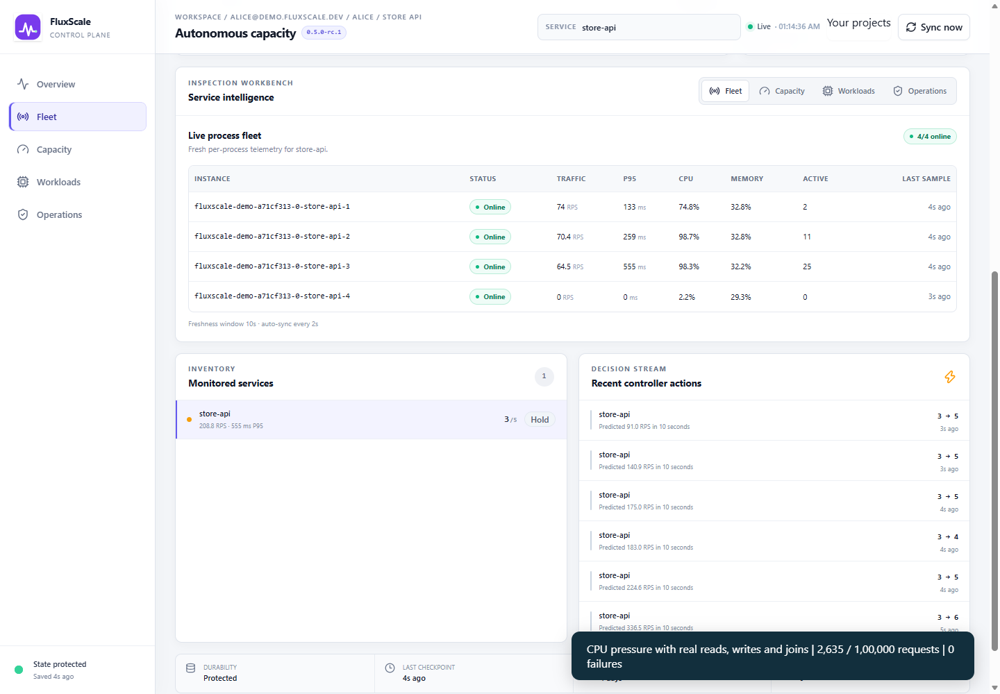
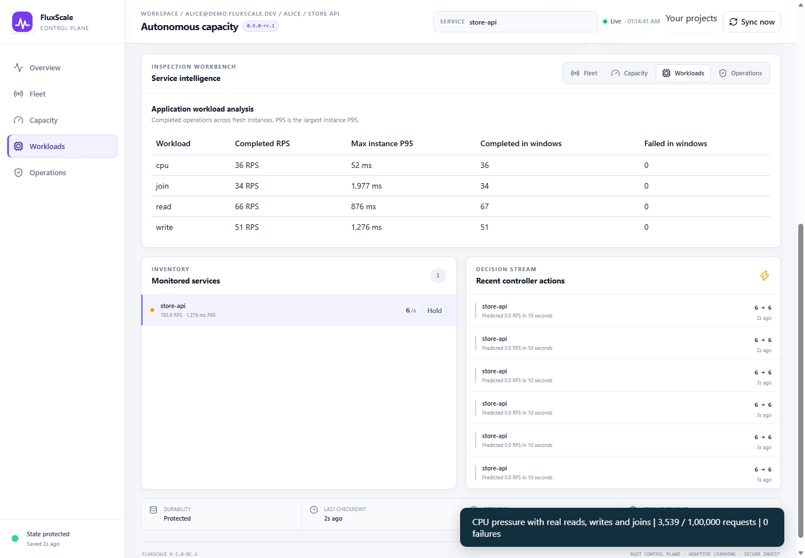
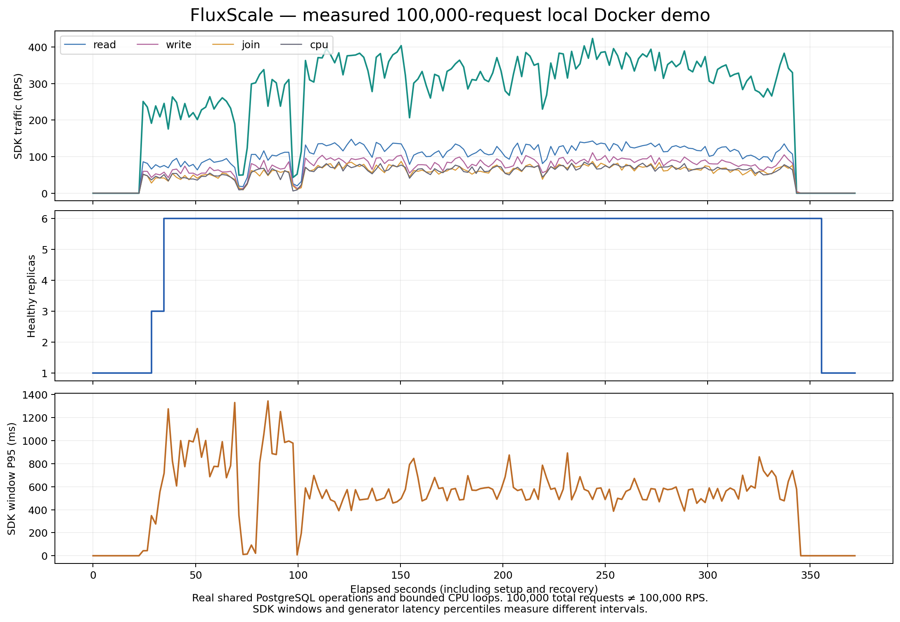

# Recorded mixed-workload autoscaling demo

This recording uses two actual accounts and two isolated local Docker deployments.
Alice sees only Store API, which receives the main workload. Bob sees only Billing
API, which receives separate baseline traffic. Server-side authorization rejects
Bob's access to Alice's project. The original FluxScale React dashboards display live SDK telemetry, actual
managed containers and scaling decisions rather than fabricated analysis.

The recorded run attempted **100,000 application requests**, with
**1,00,000 successes** and **0 failures**.
Observed healthy replicas started at **1**, reached **6**
and returned to **1** after traffic stopped. These are milestones; the raw timeline
records all intermediate replica changes. The configured application ceiling is
6 replicas. This is total volume, not 100,000 successful RPS.

The offered-rate ladder schedules 50 to 100,000 RPS and back to 50. A bounded
128-request concurrency limit prevents an unbounded client backlog. Unsent demand
counts requests which could not start; it is not successful application traffic.
This machine did not establish 100,000 successful RPS. Actually sent client
requests across the ladder and fixed-volume phases total 100,000.

| Workload phase | Target RPS | Sent | Successful | Failed | Unsent demand | Successful RPS | Client P95 ms |
| --- | ---: | ---: | ---: | ---: | ---: | ---: | ---: |
| Mixed workload warm-up | — | 1,000 | 1,000 | 0 | 0 | 218.1 | 80.12 |
| CPU pressure with real reads, writes and joins | — | 10,000 | 10,000 | 0 | 0 | 232.5 | 730.74 |
| Mixed offered-rate target: 50 RPS | 50 | 250 | 250 | 0 | 0 | 49.4 | 32.40 |
| Mixed offered-rate target: 300 RPS | 300 | 1,500 | 1,500 | 0 | 0 | 292.4 | 51.68 |
| Mixed offered-rate target: 1,000 RPS | 1000 | 1,622 | 1,622 | 0 | 3378 | 300.6 | 941.29 |
| Mixed offered-rate target: 10,000 RPS | 10000 | 1,710 | 1,710 | 0 | 48290 | 305.5 | 875.23 |
| Mixed offered-rate target: 1,00,000 RPS | 100000 | 1,739 | 1,739 | 0 | 498261 | 316.4 | 879.57 |
| Mixed offered-rate target: 50 RPS | 50 | 250 | 250 | 0 | 0 | 49.3 | 29.70 |
| Mixed traffic burst: remaining client requests | — | 81,929 | 81,929 | 0 | 0 | 340.5 | 495.58 |

These are controlled benchmark conditions, not production workload measurements.
RPS includes each phase's entire measured duration and outstanding request completion.
Recording and agent reporting run alongside the workload. Latency percentiles cover successful requests only; failed requests are
reported separately. The SDK chart uses its own reporting windows, so its P95 and
RPS should not be confused with the generator's phase-wide figures. Bob's
358 baseline requests are outside Alice's 100,000-request count.

## Real workload mix

Dispatch mixes 35% database reads, 25% POST writes, 20% five-table joins and 20%
CPU operations. Failures and concurrency can change the completed mix. Reads
select product rows; writes increment shared PostgreSQL counters. Joins aggregate
customers, orders, order items, products and categories. CPU routes perform real
bounded computation: 40 ms during pressure and 5 ms in other phases.
The database contains 2,000 customers, 12,000 orders and 60,000 order items.

| Workload | Sent | Successful | Failed |
| --- | ---: | ---: | ---: |
| read | 35,016 | 35,016 | 0 |
| write | 25,001 | 25,001 | 0 |
| join | 19,992 | 19,992 | 0 |
| cpu | 19,991 | 19,991 | 0 |

Independent database inspection found **25,001
committed writes**, including **25,001
acknowledged writes**. The shared database is independent of application replicas
and has no published host port. A separate test proves writes survive application
replica removal. The generator and proxy never replay mutation requests.
Database capacity, database replicas and cloud VMs are not autoscaled here.








Raw evidence: [phase results](assets/demo-result.json) and
[time-series samples](assets/demo-timeline.json).

## Architecture and integration

Customer requests pass through the local health-aware HTTP proxy to the managed
application replicas. SDK middleware sends per-instance request/resource telemetry
to the Rust controller. The controller predicts demand, evaluates pressure and
reconciles real Docker containers. New replicas must become healthy before routing;
scale-in drains active proxy requests before container removal. Scale-in considers
retained recent measured demand and pressure, so a brief forecast dip cannot
erase current demand. The timeline exposes the resulting replica behavior.

An outbound agent reports each deployment to the connected dashboard using a
project-scoped credential. Each account can access only its own projects, reports
and policies. Local controller credentials stay on the deployment host. Versioned
dashboard policies are acknowledged after local checkpointing, and the host's
configured replica limits remain authoritative.

Start with [SDK and Docker integration](INTEGRATION.md), then
[individual accounts and project dashboard setup](CONNECTED_DEPLOYMENT.md).
The supported execution path is one stateless Dockerized Node/Express application
per local controller. No cloud VM creation, Kubernetes, serverless or HA is claimed.
Repository: [ombhayde/FluxScale](https://github.com/ombhayde/FluxScale).

## Reproduce and record

Build the application image and controller image, and run `npm ci` and
`npm run build` in `dashboard-react`. Use Node 24.18+ (24.x), Docker with Linux
containers, a Chromium browser and FFmpeg. On Windows the recorder finds installed
Edge by default. Set `FLUXSCALE_BROWSER` or `FLUXSCALE_FFMPEG` to other installed
executables. On Linux, set both executable variables explicitly before recording.
The optional recording tooling is separate from the application.

```powershell
.\scripts\build_demo_image.ps1
.\scripts\build_deployment.ps1
docker pull postgres:18-alpine
node scripts/record_demo.mjs
```

The recorder creates its own accounts, credentials, networks, two controllers and
application containers and a disposable shared PostgreSQL database. It restricts load to loopback targets and makes exactly
100,000 primary client requests without generator retries. The proxy may retry
a GET/HEAD transport failure once against another healthy backend; therefore
upstream attempts can exceed the client request count. Cleanup stops only the
containers it owns. Existing user services are not used for the demonstration.

Outputs under `artifacts/demo/`: `fluxscale-demo.mp4`, `result.json`,
`timeline.json`, phase results and screenshots. The MP4 captures the browser at
2 frames per second and encodes a 24 FPS video; it does not substitute simulated
dashboard data. Generate exportable PNG/PDF plots with
`python scripts/plot_demo.py` (requires matplotlib), then update this page and the
announcement with `node scripts/summarize_demo.mjs`.

## Recording sequence

1. Architecture: traffic, telemetry, real Docker control and per-user analysis.
2. Bob's account: baseline traffic in Billing API, with no Alice project visible.
3. Alice's account: request counter, workload phases and Store API analysis.
4. Actual scale-out, workload analysis and a ramp of offered-rate targets.
5. Mixed traffic burst, idle recovery and actual scale-in to one healthy replica.

Attach the MP4 directly to LinkedIn and link this repository. Keep the detailed
analysis accessible beside the integration guide; do not advertise the workload
as cloud production certification. Two earlier rehearsals recorded one and two
HTTP failures respectively and exposed burst scaling churn. The proxy now has
tested read failover, and scale-in stabilization considers actual recent demand.
The final mixed run above has its own measured outcome. Sustained production
reliability still requires representative deployment testing.
